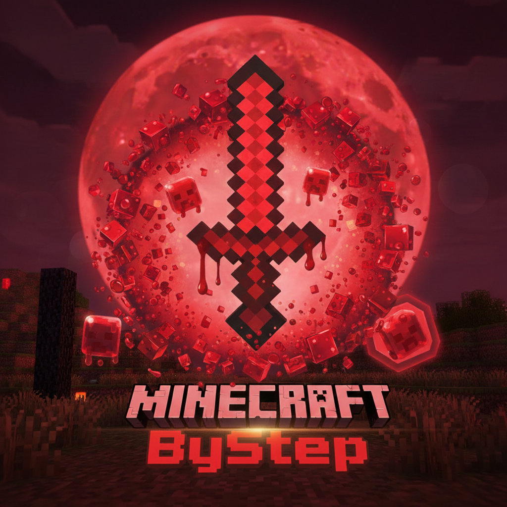

<div align="center">



# ByStep Launcher

Кастомный лаунчер Minecraft для сервера ByStep

<br>

[](https://github.com/PRISSET/Launcher/releases/latest)
[](https://github.com/PRISSET/Launcher/releases)
[](https://github.com/PRISSET/Launcher/releases)

---

</div>

## О проекте

ByStep Launcher — современный лаунчер Minecraft, созданный на Rust с использованием фреймворка Iced. Разработан для комфортной игры на сервере ByStep с автоматическим управлением модами и красивым анимированным интерфейсом.

<br>

## Возможности

| Функция | Описание |
|---------|----------|
| Автоустановка | Minecraft 1.21.1 с Fabric |
| Управление модами | Автозагрузка и синхронизация с GitHub |
| Шейдеры | Встроенная поддержка шейдеров через Iris |
| Java | Автоматическая установка Java 21 |
| Статистика | Отслеживание времени игры |
| Discord | Rich Presence показывает вашу активность |
| Онлайн сервера | Отображение игроков на сервере |
| Автообновление | Бесшовное обновление лаунчера |

<br>

## Системные требования

| Компонент | Минимум | Рекомендуется |
|-----------|---------|---------------|
| ОС | Windows 10 | Windows 11 |
| ОЗУ | 4 ГБ | 8 ГБ |
| Диск | 2 ГБ | 4 ГБ |
| Сеть | Требуется | Требуется |

<br>

## Установка

1. Скачайте установщик по кнопке выше
2. Запустите `ByStep-Launcher-Setup.exe`
3. Введите никнейм
4. Нажмите Играть

<br>

## Сборка из исходников

```bash
git clone https://github.com/PRISSET/Launcher.git
cd Launcher
cargo build --release
```

<br>

---

<div align="center">

Разработано PRISSET

</div>
